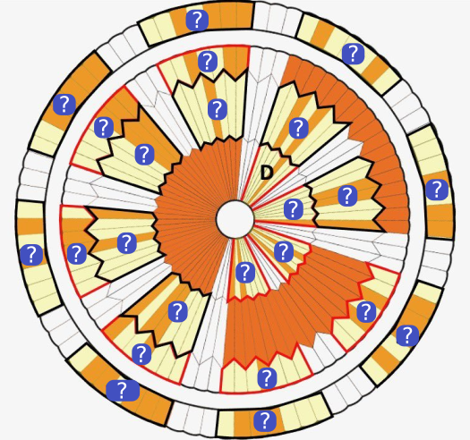

# Le message secret de Perseverance

Lors de sa descente vers la planète Mars le 18/02/2021, le rover Perseverance de la Nasa a freiné sa chute grâce à un parachute qui a intrigué quelques internautes du forum Reddit.

{: .center}

Vidéo du déploiement du parachute :

<iframe width="790" height="444" src="https://www.youtube.com/embed/N3b-1-yrQYw" title="YouTube video player" frameborder="0" allow="accelerometer; autoplay; clipboard-write; encrypted-media; gyroscope; picture-in-picture" allowfullscreen></iframe>

Les zones blanches et rouge se décomposent comme ceci :

{: .center}

### Indications

- Le tout premier secteur contenant un message est le secteur sur lequel est écrite la lettre D, qui est effectivement la signification de ce secteur. C'est en l'observant bien que vous comprendrez le codage qui a été utilisé.
- Les autres secteurs sont marqués de points d'interrogation : c'est à vous de découvrir ce qu'ils cachent.
- La phrase mystère s'obtiendra en tournant en spirale depuis la lettre D, dans le sens horaire.
- La dernière couronne (la plus à l'extérieur) est un peu particulière, mais n'en disons pas plus...

[indices](data/mars/parachute_perseverance.pdf)

<object data="data/mars/parachute_perseverance.pdf" type="application/pdf" width="700px" height="700px">
    <embed src="data/mars/parachute_perseverance.pdf">
        
This browser does not support PDFs. Please download the PDF to view it: <a href="data/mars/parachute_perseverance.pdf">Download PDF</a>.

    </embed>
</object>

### À vous !

### Update : faites votre propre parachute !
[https://sjwarner.github.io/perseverance-parachute-generator/?](https://sjwarner.github.io/perseverance-parachute-generator/?)

