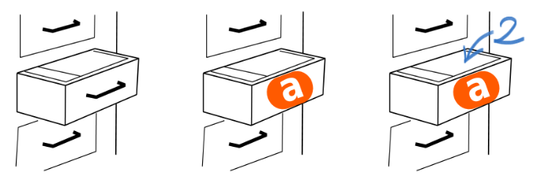
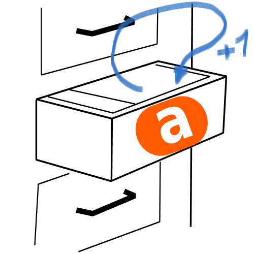
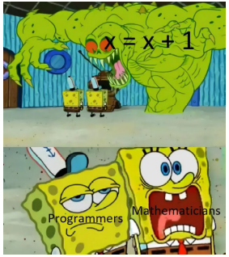
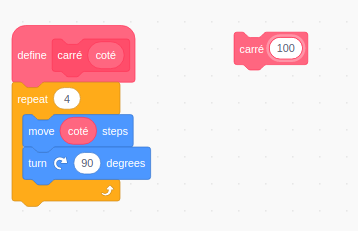

## 1. Variables et affectation


### 1.1 Stocker une valeur dans une variable
La mémoire d'un ordinateur peut-être perçue comme un ensemble de tiroirs.

Écrire  l'instruction :
```python
a = 2
```

va provoquer chez l'ordinateur (en simplifiant beaucoup) le comportement suivant :

- Est-ce que je possède **déjà** un tiroir appelé ```a``` ? 
    - si oui, je me positionne devant.
    - si non, je crée un tiroir appelé ```a```.


{: .center}


- J'ouvre le tiroir et j'y dépose la valeur numérique 2. Si le tiroir contenait déjà une valeur, celle-ci disparaît. On dit souvent qu'elle est **écrasée**.

!!! info "Remarque"
    Cette présentation est utile pour comprendre la notion de variable dans une première approche, mais elle n'est pas vraiment fidèle à la réalité.


!!! warning "Signification du signe ="
    Le sens du signe = n'est donc **pas du tout le même** qu'en mathématiques. On dit que c'est un signe d'**affectation**. 

    L'écriture a = 2 signifie donc a ← 2 et peut se lire «a reçoit la valeur 2» ou encore «on affecte à a la valeur 2».

!!! info "Remarque"
    Ici, nous avons stocké un nombre (le nombre 2) dans la variable ```a```. Mais une variable peut contenir une phrase, une liste de nombres, une image... beaucoup d'objets de **type** différent.

### 1.2  Récupérer la valeur stockée dans une variable

#### 1.2.1 Dans un script
Dans un script Python, pour afficher le contenu d'une variable, on utilisera la fonction ```print()```.

```python
a = 2
maison = "Serdaigle"
print(a)
print(maison)
```

renverra la sortie suivante :

```python
2
'Serdaigle'
```

{{ IDEv() }}

#### 1.2.2 En console

Dans la console interactive de Python, c'est encore plus simple, il suffit d'écrire le nom de la variable et d'appuyer sur Entrée.

```python
>>> a
2
>>> maison
'Serdaigle'
>>> b
Traceback (most recent call last):
  File "<pyshell>", line 1, in <module>
NameError: name 'b' is not defined
```

{{ terminal() }}

Bien sûr, il faut que la variable ait été créée au préalable... sinon Python renvoie un message d'erreur.


### 1.3 Modifier le contenu d'une variable

#### 1.3.1 Écraser une ancienne valeur
Comme déjà évoqué, affecter une nouvelle valeur dans une variable déjà existante écrasera l'ancienne valeur. C'est très pratique, mais parfois dangereux.

```python
>>> a = "mon mot de passe ultrasecret"
>>> a
"mon mot de passe ultrasecret"
>>> a = 3
>>> a
3
```
#### 1.3.2 Utiliser des variables pour calculer de nouvelles variables

```python
AB = 3
AC = 4
BC = (AB**2 + AC**2)**0.5
print("l'hypoténuse mesure", BC, "centimètres")
```

!!! info "Remarque"
    En Python, la puissance s'obtient par ```**```. La racine carrée est une puissance ```0.5```.


#### 1.3.3 Modifier une variable à partir d'elle-même

L'instruction
```python
a = a + 1
```
écrit une égalité mathématique fort peu intéressante (toujours fausse, car elle est équivalente à l'égalité 0 = 1), 
mais est une écriture informatique très utile : la variable ```a``` se modifie à partir d'elle-même.

{: .center width=20%}


```python
a = 10
a = a + 1
print(a)
```

renverra 
```python
11
```

La compréhension de l'instruction ```a = a + 1```  est **essentielle**. 

{: .center}

#### 1.3.4 Inverser deux variables

Imaginons les variables suivantes :

```python
maisonHarry = "Serpentard"
maisonMalfoy =  "Gryffondor"
```

Il semblerait qu'une erreur se soit glissée dans ces déclarations de variables... Mais comment faire pour inverser les valeurs ?

▸ **Méthode naïve**

```python
maisonHarry = maisonMalfoy
maisonMalfoy = maisonHarry
```
à l'arrivée, on se retrouve avec 
```python
>>> maisonHarry
'Gryffondor'
>>> maisonMalfoy
'Gryffondor'
```

En effet, la variable ```maisonHarry```  a été écrasée...  et on ne peut plus retrouver sa valeur pour la donner à ```maisonMalfoy```.

▸ **La solution universelle**

Nous allons passer par une variable temporaire qui nous permettra de stocker la valeur écrasée.

```python
maisonHarry = "Serpentard"
maisonMalfoy =  "Gryffondor"

# on procède à l'échange

t = maisonHarry
maisonHarry = maisonMalfoy
maisonMalfoy = t
```

Ainsi, 
```python
>>> maisonHarry
'Gryffondor'
>>> maisonMalfoy
'Serpentard'
```


▸ **La solution «pythonesque»**

Chaque langage de programmation ayant ses particularités, Python propose une syntaxe particulièrement agréable pour pouvoir faire l'échange de deux variables sans faire intervenir une variable temporaire :

```python
a = 2
b = 5

# on procède à l'échange
a,b = b,a
```
Ainsi,
```python
>>> a
5
>>> b
2
```

Les variables ont bien été échangées. 


!!! info "Remarque"
    Python ne fait que nous faciliter le travail. Il a dû lui-même créer une variable temporaire pour stocker la variable ```a``` avant de l'écraser : la simultanéité n'existe pas en informatique !

### 1.4 Jouer avec les variables
L'objet de l'activité est de prendre un code pré-existant, produisant une animation graphique, et de le modifier petit à petit pour comprendre le rôle de chaque élément. 

Dans la fenêtre ci-dessous, cliquer sur le bouton Play pour démarrer l'animation.


<iframe src="https://trinket.io/embed/python/bd1c5be675" width="100%" height="500" frameborder="0" marginwidth="0" marginheight="0" allowfullscreen></iframe>

Vous pouvez coder directement dans la fenêtre ci-dessus, ou bien ouvrir [ce lien](https://trinket.io/embed/python/bd1c5be675){target=_blank} dans une nouvelle fenêtre (clic-droit «Ouvrir le lien dans une nouvelle fenêtre) afin de pouvoir avoir les instructions et la fenêtre de code côte-à-côte.

#### 1.4.1 Quelques indications sur le code d'origine 

 - ```background(r, g, b)``` : l'arrière-plan sera de la couleur ```(r,g,b)```, où ```r```, ```g``` et ```b``` sont des nombres compris entre 0 et 255, déterminant les composantes rouge, verte et bleue de la couleur totale. Voir  [ici](https://www.w3schools.com/colors/colors_rgb.asp){target=_blank} .
- ```size(x,y)``` : l'espace de dessin mesurera ```x``` pixels de large sur ```y``` pixels de haut.

- ```frameRate(n)``` : l'animation sera rafraîchie ```n``` fois par seconde.

- ```noStroke()``` : les futurs tracés n'auront pas de contour.

- ```fill(r, g, b)``` : les futures figures tracées seront remplies avec la couleur ```(r,g,b)```.

- ```randint(a,b)``` : renvoie un nombre pseudo-aléatoire entre ```a``` et ```b```.

- ```ellipse(x, y, rayon, rayon``` : trace un disque de centre ```(x, y)``` et de rayon ```rayon```.

#### 1.4.2 Manipulations à effectuer
1. Modifier alternativement les paramètres ```rayon```, ```r```, ```g``` ou ```b``` afin d'observer et comprendre leur rôle. .
2. Modifier le ```frameRate``` pour observer son rôle.
3. Faire en sorte que les disques dessinés soient de couleur aléatoire.
4. Faire en sorte que les disques soient de rayon aléatoire.
5. Les instructions ```mouseX``` et ```mouseY``` renvoient respectivement l'abscisse et l'ordonnée de la souris. Faire en sorte que les disques se dessinent là où se trouve la souris.
6. Trouver d'autres figures à tracer à [cette adresse](https://py.processing.org/tutorials/drawing/){target=_blank} et laisser parler son talent artistique...


### 1.5 Vers les tests...

<iframe src="https://trinket.io/embed/python/d9e1c58ea0" width="100%" height="600" frameborder="0" marginwidth="0" marginheight="0" allowfullscreen></iframe>

[Lien vers l'activité](https://trinket.io/library/trinkets/d9e1c58ea0) pour une utilisation dans une nouvelle fenêtre.

L'objectif est de faire bouger la balle... puis la faire rebondir !

#### 1.5.1 Mouvement de la balle

Pour l'instant la balle est statique. Du moins elle *apparaît* statique, mais elle en fait redessinée au même endroit 25 fois par seconde !

1. Comment faire en sorte qu'à chaque tour de boucle (25 fois par seconde donc) la balle ne soit pas redessinée au même endroit, mais légèrement décalée vers la droite ? 
2. Résoudre le problème de superposition des anciennnes balles afin de donner l'illusion d'un mouvement
3. Stocker dans une variable appelée ```dx``` le décalage de l'abscisse.
 

#### 1.5.2 Rebond de la balle
Pour l'instant, notre balle s'enfuit désespérément... Comment détecter qu'elle est sortie de son aire de jeu ?

## 2. Instructions conditionnelles
Un ordinateur ne fait pas que *stocker* des valeurs dans des variables et les faire évoluer.
Il effectue aussi des **tests** pour déclencher (ou pas) d'autres actions. On parle alors d'*instructions conditionnelles*.

### 2.1 Premier test élémentaire
La syntaxe d'un test en Python est la suivante :
```python
if condition :
  instruction
```
Remarquez bien :
- les deux points qui suivent la condition : ils signalent l'ouverture d'un bloc de code, celui qui sera exécuté si la condition est valide.
- le léger décalage (appelé **indentation**) de la ligne (ou les lignes) contenant l'instruction à exécuter. Cette indentation n'est pas «décorative» : elle est cruciale pour que Python comprenne quelle partie de code doit être exécutée ou pas.

**Exemple**
```python
heure = 13
if heure > 12 :
  print("j'ai faim")
```
Ce code va renvoyer ```j'ai faim``` car la condition est validée. On dit que la condition est «vraie».

#### 2.1.2 Le retour de la balle fuyante
1. Détectez que la balle est sortie en faisant apparaître le mot "sortie..." en console (le mot apparaîtra sous la zone de dessin).
2. Modifiez le code pour que la balle reparte dans l'autre sens au lieu de s'enfuir.

**Point d'étape**

<iframe src="https://trinket.io/embed/python/ba7d676493" width="100%" height="600" frameborder="0" marginwidth="0" marginheight="0" allowfullscreen></iframe>

3. Faites rebondir la balle sur les **deux** murs
4. Faites en sorte que la balle n'ait plus qu'un simple mouvement latéral mais un mouvement «de travers»
5. Gérez les rebonds, rajoutez de l'aléatoire...


Voir un exemple de correction, ici : [https://trinket.io/library/trinkets/05b7d7f7c3](https://trinket.io/library/trinkets/05b7d7f7c3)... et amusez-vous à modifier ce code !


## 3. Les fonctions en Python

### 3.1 Principe général : à quoi sert une fonction ?
L'idée principale qu'il faut garder en tête est celle-ci : une fonction **est un raccourci**, permettant une utilisation simple et rapide d'un processus répétitif.

Par exemple, en Scratch, si on sait que l'on va avoir à tracer beaucoup de carrés, on crée un bloc ```carre``` :


Il est à noter que lorsqu'on créé le bloc ```carre```, rien ne se passe, rien n'est tracé. Ce n'est que lorqu'on va se servir de ce bloc (on dira qu'on *appelle* le bloc) qu'une action aura lieu.

Pour faire un parallèle avec la vie courante, vous avez tous appris un jour à faire vos lacets. C'est une fonction (un ensemble de gestes et de techniques) qui est disponible et dont vous ne vous servez que lorsque vous en avez besoin (quand vos lacets sont défaits).

### 3.2 Premières fonctions en Python.
Une fonction en Python se déclare par le mot clé ```def```.

```python
def hymne_anglais():
      print("God save our gracious Queen")
      print("Long live our noble Queen")
      print("God save our Queen")
```

**À remarquer :**
- les parenthèses à la fin du nom de la fonction (indispensables) : elles contiendront plus tard les paramètres de la fonction.
- le deux points : à la fin de la déclaration du nom de la fonction. Ils vont déclencher une indentation automatique du reste du corps de la fonction.

**Utilisation :**
```
>>> hymne_anglais()
God save our gracious Queen
Long live our noble Queen
God save our Queen
```

Cette fonction n'a **aucun paramètre d'entrée**. Elle affichera toujours la même chose lorsqu'on l'appellera. 

### 3.3 Paramètres d'une fonction

L'inconvénient majeur des fonctions précédentes est qu'elles produisent **toujours** la même chose.  
Le carré en Scratch fera toujours 50 pixels de côté, l'hymne affiché sera toujours l'hymne anglais... 
Pour améliorer ceci, il est possible de donner à la fonction un (ou plusieurs) **paramètre**(s).



La fonction ```carré()``` comporte maintenant un paramètre, qu'on a appelé ```coté```, mais qu'on aurait pu appeler ```n```, ```x```, ou ```djhfidshflsdm```. Cela n'a aucune influence sur le fonctionnement du code. Mais ça en a une sur la compréhension de celui-ci ! On choisira donc toujours un nom explicite.

Lorsqu'on appelle ensuite la fonction ```carre(100)```, la fonction est exécutée avec à la place de la variable ```coté``` la valeur ```100```.  Elle trace donc un carré de côté 100.

En Python, créons par exemple une fonction ```hymne(pays)```  :

```python
def hymne(pays):
    
    if pays == "ANG":
      print("God save our gracious Queen")
      print("Long live our noble Queen")
      print("God save our Queen")
      
    if pays == "FRA":
      print("Allons enfants de la patri-i-euh")
      print("Le jour de gloire est arrivé")
```

Notre fonction comporte maintenant un paramètre qui va influer sur l'action de la fonction :

```
>>> hymne("ANG")
God save our gracious Queen
Long live our noble Queen
God save our Queen

>>> hymne("FRA")
Allons enfants de la patri-i-euh
Le jour de gloire est arrivé

>>> hymne("USA")

>>> hymne(5)

>>>
```

**À remarquer :**
- L'utilisateur de la fonction peut utiliser la fonction ```hymne()``` avec des valeurs du paramètre ```pays```non prévus par le programmeur. Dans notre cas, cela n'est pas grave (il ne se passe rien), mais parfois cela peut provoquer une erreur.

### 3.4 Fonctions utilisant d'autres fonctions

Le code précédent peut aussi s'écrire de cette manière :

```python
def hymne_anglais():
    print("God save our gracious Queen")
    print("Long live our noble Queen")
    print("God save our Queen")    


def hymne_francais():
    print("Allons enfants de la patri-ie-euh")
    print("Le jour de gloire est arrivé")   


def hymne(pays):
    if pays == "ANG":
        hymne_anglais()
    if pays == "FRA":
        hymne_francais()

```

Ce type d'écriture de code (qu'on appellera _écriture modulaire_) est une bonne habitude à prendre car elle sépare les différentes actions en fonctions spécifiques. Si je dois rajouter un vers à l'hymne français, je vais uniquement toucher à la fonction ```hymne_francais()```, et pas aux autres fonctions qui ne sont pas concernées.

### 3.5 Fonctions renvoyant une valeur

⚠ **Très important** ⚠

Jusqu'à présent, les fonctions utilisées étaient uniquement des «raccourcis» permettant de mieux structurer le code et d'éviter les répétitions.  
Or, les fonctions peuvent être encore plus intéressantes lorsqu'on comprend qu'elles peuvent **renvoyer une valeur**. On s'approche alors de la définition mathématique du concept de fonction.

Le mot-clé pour le renvoi d'une valeur est l'instruction ```return```.

**Exemple :**

```python
def aucarré(n):
    p = n*n
    return p
```

À l'utilisation, cette fonction ne semble pas pour l'instant différente des précédentes :

```
>>> aucarré(4)
16
>>>
``` 

Ce qu'il faut absolument comprendre, c'est que ```aucarré(4)``` est en fait un **nombre**. 
Et donc, je peux l'utiliser dans des calculs :

```
>>> 12 + aucarré(5)
37
``` 

#### 3.6 Application à un exercice classique de mathématiques

Imaginons deux tarifs A et B pour le prix d'un ticket d'entrée au cinéma.
- Tarif A : 7 € la place
- Tarif B : 13 € l'abonnement puis 5 € la place

Pour un nombre ```n``` d'entrées, quel est le tarif le plus avantageux ?

1. Créer une fonction ```tarif_A(n)``` qui renvoie le prix pour ```n``` entrées au tarif A.
2. Créer une fonction ```tarif_B(n)``` qui renvoie le prix pour ```n``` entrées au tarif B.
3. Créer une fonction ```meilleur_choix(n)``` qui écrira ```"il faut choisir le tarif A"``` ou bien ```"il faut choisir le tarif B"``` en fonction du tarif le moins cher. Cette fonction ne renverra aucune valeur.


**Correction**

```python
def tarif_A(n):
    p = 7*n
    return p

def tarif_B(n):
    p = 13 + 5*n
    return p

def meilleur_choix(n):
    if tarif_A(n) < tarif_B(n):
        print("il faut choisir le tarif A")
    if tarif_A(n) > tarif_B(n):
        print("il faut choisir le tarif B")
    if tarif_A(n) == tarif_B(n):
        print("les deux tarifs sont équivalents")
```

