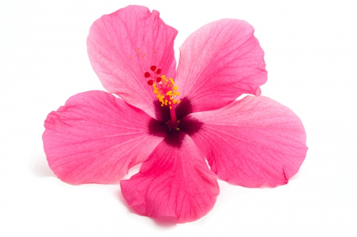

# Activité 1 : modification d'une image en Python


Nous allons jouer avec les pixels de l'image ci-dessous.

{: .center}

## 1. Ouverture de l'activité Capytale.

1. Connectez-vous à [Monlycée.net](https://ent.iledefrance.fr/auth/login?callback=https%3A%2F%2Fent.iledefrance.fr%2F#/){. target="_blank"}.
2. Cliquez ensuite sur [ce lien](https://capytale2.ac-paris.fr/web/c/77f9-2180060). 


Vous êtes alors renvoyés vers le service Capytale, qui permet le partage d'activités Python.

## 2. Modification des couleurs de l'image ```fleur.jpg```.

!!! abstract "Principe"
    - On parcourt l'image pixel par pixel. Pour chaque pixel :
    - On récupère ses composantes RGB dans des variables ```r```, ```g```, et ```b```.
    - On crée 3 nouvelles variables   ```new_r```, ```new_g```, et ```new_b``` à partir (ou pas) des valeurs originales ```r```, ```g```, et ```b```.
    - On modifie le pixel actuel avec ces nouvelles composantes ```new_r```, ```new_g```, et ```new_b```.


### Si on souhaite travailler avec sa propre image :


{: .center }


Cliquer sur Capytale / Fichiers annexes / Disponibles le temps de la session / Ajouter un fichier disponible le temps de la session.

## 3. Modification des pixels suivant leur couleur d'origine

La condition «Si le pixel est blanc» se traduit dans notre code par le test :
```python
if (r, g, b) == (255, 255, 255):
```

Essayez de modifier uniquement les pixels blancs de notre image (pour les rendre bleus, par exemple).