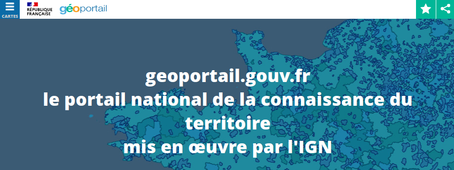

# Activité 3 : Utilisation de GéoPortail

[{: .center}](https://www.geoportail.gouv.fr/){. target="_blank"}

## 1. Préambule

La référence explicite à GéoPortail dans le programme de SNT peut se voir comme une volonté de promouvoir un service beaucoup moins connu que Google Maps. Il peut être intéressant de remarquer que GeoPortail est une plateforme nationale et respectueuse des données utilisateurs.
De même, une recherche internet sur les tarifs de Google Maps peut permettre de découvrir comment la situation de quasi-monopole de Google lui a permis de décider de changer brutalement sa politique tarifaire en juin 2018. De nombreux sites ont alors dû se tourner vers des alternatives comme GéoPortail ou OpenStreetMap, qui possèdent des avantages que nous allons découvrir.

## 2. GéoPortail

### 2.1 Principe de fonctionnement

- Accès : [https://www.geoportail.gouv.fr/](https://www.geoportail.gouv.fr/){. target="_blank"}
- GéoPortail permet de superposer une multitude de couches différentes sur des domaines très variés. Quatre couches (appelés *fonds de cartes*) très utilisées apparaissent en raccourci dans le menu latéral.

{: .center}

Le bouton « Voir tous les fonds de carte » permet d’afficher, classés par thèmes, toutes les ressources disponibles.

### 2.2 Questions

!!! info
    Pour chaque question, faites une capture d'écran du résultat obtenu sur géoportail et collez-la sur votre compte-rendu.

#### 2.2.1 Cadastre
Recherchez le numéro de la parcelle cadastrale de votre domicile. Mesurez la superficie de cette parcelle. Vous pouvez vous aider du tutoriel vidéo ci-dessous.

<iframe width="696" height="390" src="https://www.youtube.com/embed/rbl2sF7zugk" title="YouTube video player" frameborder="0" allow="accelerometer; autoplay; clipboard-write; encrypted-media; gyroscope; picture-in-picture" allowfullscreen></iframe>

#### 2.2.2 Gêne sonore
Monsieur X veut acheter une maison au 22 chemin de Chilly à Champlan. Mais il ne supporte pas le bruit. Que lui conseillez-vous ?

#### 2.2.3 Drone de loisirs
Madame Y possède un drone de loisir et souhaite le faire voler au Bois du Pré à Cheptainville à une altitude d’environ 60 mètres. En a-t-elle le droit ? Sinon à quelle altitude est-elle limitée ? 

#### 2.2.4 Bureau de Poste
Monsieur Z habite 5 allée des érables à Marolles en Hurepoix. Il veut savoir s'il peut aller à pied à un bureau de Poste en moins de 15 minutes. Pouvez-vous l'aider et lui indiquer l'adresse du bureau de poste ?
(outil utile : clic-droit / Isochrone depuis ce lieu)

#### 2.2.5 Au XIXème siècle
Au XIXe siècle, comment appelait-on le champ sur lequel est aujourd'hui construit le Lycée ?  

{#
??? tip "Corrections"
    1. Territoires et transports / Foncier, cadastre et urbanisme / Parcelles cadastrales, puis mesure de surface (clé à molette)
    2. Territoires et transports / Foncier, cadastre et urbanisme / Plan d'exposition au bruit (PEB). Zone déconseillée pour le bruit.
    3. Territoires et transports / Foncier, cadastre et urbanisme / Restrictions UAS catégorie Ouverte et aéromodélisme. Hauteur max de vol : 50m
    4. Territoires et transports / Equipements publics / Services postaux. D'après l'isochrone 15mn à pied, un bureau de poste est accessible.
#}

### 2.3 Recherche de renseignements en source ouverte ([OSINT](https://www.lesassisesdelacybersecurite.com/Le-blog/Glossaire/Open-Source-Intelligence-OSINT){. target="_blank"})
#### 2.3.1 Énigme 1
1. Ai-je le droit de prendre une photo aérienne de l’endroit aux coordonnées GPS : 48.59720341938274, 2.2030987620155575 ?
2. Que trouve-t-on à ces coordonnées ?
3. Quelles-en sont les activités ?

{#
??? tip "Corrections"
    1. Territoires et transports / Description du territoire / Zones interdites à la prise de vue aérienne (ZIPVA). Zone interdite
    2. Le CEA de Bryères le Châtel.
    3. "Il conçoit les charges nucléaires des armes de la dissuasion et garantit leur sûreté et leur fiabilité, en s’appuyant sur le programme Simulation. Il met son expertise technique au service des Autorités dans la lutte contre la prolifération nucléaire et le terrorisme, et les alerte en cas de séisme, de tsunami ou d'essai nucléaire étranger. Il assure l’ingénierie nucléaire des infrastructures complexes de la Direction des applications militaires, de leur conception jusqu’à leur démantèlement. Il co-développe avec Atos les supercalculateurs, au meilleur niveau mondial, qu’il exploite pour sa mission Défense, et dont sont issus les calculateurs du Très Grand Centre de Calcul (TGCC) que la DIF opère au profit de l’industrie et de la recherche." 
#}

#### 2.3.2 Énigme 2 :skull:
{: .center width=60%}

Sur cette image extraite de GéoPortail, le point jaune désigne une plage à laquelle s'intéresse **beaucoup** une très grande entreprise bien connue.
Quelle est cette société ?

??? abstract "indice"
    Développement Durable / Mer et Littoral

{#
??? tip "Correction"
    - Développement Durable / Mer et Littoral / Câbles et conduites sous-marines.
    - L'endroit est Saint-Hilaire-de-Riez en Vendée.
    - Google va y faire arriver un câble reliant la France et les USA : [https://france3-regions.francetvinfo.fr/pays-de-la-loire/vendee/vendee-arrivee-du-fur-cable-transatlantique-google-saint-hilaire-rietz-1799482.html](https://france3-regions.francetvinfo.fr/pays-de-la-loire/vendee/vendee-arrivee-du-fur-cable-transatlantique-google-saint-hilaire-rietz-1799482.html){. target="_blank"}
#}
