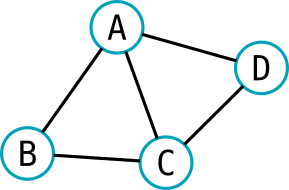

# Activité 2 : Réseaux sociaux et graphes

## 1. Modéliser les relations par un graphe

Sur les réseaux sociaux, certaines relations sont symétriques («être amis» sur Snapchat) ou aysmétriques («être un follower» sur X ex Twitter).

**Exercice :** Classifiez les réseaux sociaux que vous connaissez en *symétriques* ou *asymétriques*.

### 1.1 Facebook : graphe non orienté

{: .center width=30%}

### 1.2 Twitter : graphe orienté

{: .center width=30%}

Un graphe réel peut donner des choses [comme ceci.](https://github.com/eleurent/twitter-graph/blob/master/examples/friends/friends_label_1080p.jpg){target = "_blank"}
 
## 2. Pourquoi j'ai moins d'amis que mes amis ?

Basé sur la vidéo de Mickaël Launay : 

<iframe width="933" height="525" src="https://www.youtube.com/embed/MySkCFFgiRQ" title="YouTube video player" frameborder="0" allow="accelerometer; autoplay; clipboard-write; encrypted-media; gyroscope; picture-in-picture" allowfullscreen></iframe>

Soit un ensemble d'amis connectés sur un réseau social quelconque. Voici les interactions qu'on a recensées :

- André est ami avec Béa, Charles, Estelle et Fabrice,
- Béa est amie avec André, Charles, Denise et Yasmina,
- Charles est ami avec André, Béa, Denise, Estelle, Fabrice et Yanis,
- Denise est amie avec Béa, Charles et Estelle,
- Estelle est amie avec André, Charles et Denise,
- Fabrice est ami avec André, Charles et Yanis,
- Yanis est ami avec Charles et Fabrice,
- Yasmina est amie avec Béa.

**Questions**

{: .center}

 
1. Dessinez le graphe de ce réseau social.  
2. Écrivez à coté de chaque nœud le nombre d'amis de chacun. 
5. Quelle est la personne qui a le plus d'amis ? 
6. Quelle est la personne qui a le moins d'amis ?
7. Quelle distance (en nombre de lien) qui sépare Béa d'Estelle ? 
8. Existe-t-il dans ce graphe deux personnes plus éloignées que de 2 liens ? 
3. Calculez la moyenne du nombre d'amis dans la totalité de ce réseau social.
4. Calculez pour chacun personne, la *moyenne du nombre d'amis de leurs amis*.  
Par exemple : Yanis ne voit pas tout le graphe, il ne perçoit que Fabrice (3 amis) et Charles (6 amis).  
La moyenne des amis de ses amis est de $\frac{3+6}{2}=4,5$ amis.  
Notez cette moyenne d'une couleur différente.
4. Calculez le pourcentage de personnes qui ont moins d'amis que le nombre moyen d'amis de leurs amis.
5. Comment expliquer ce phénomène ?

