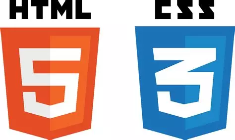

{: .center}

Les pages Web sont écrites dans le langage HTML (HyperText Language Markup, soit « langage de balisage d'hypertexte ») qui est un langage de balises (markup signifie balise en anglais).  

Les feuilles de style en cascade, généralement appelées CSS de l'anglais Cascading Style Sheets, forment un langage informatique qui décrit la présentation des documents HTML, elles donnent du style aux pages web ecrites en HTML.

!!! info
    Le langage HTML a été inventé et développé par Tim Berners-Lee et Robert Cailliau au début des années 1990. C'est en 1993 que la version initiale de HTML apparaît. Depuis 2007, c'est la version 5 de HTML qui est utilisée, on parle de HTML 5.

**Dans cette séance, vous allez découvrir ce qu'est une balise puis vous écrirez votre première page WEB en HTML-CSS.**

## Activité 1
[ici](https://capytale2.ac-paris.fr/web/c/cd32-3672599){: target = "_blank"}

## Activité 2
[ici](https://capytale2.ac-paris.fr/web/c/eba1-3675894){: target = "_blank"}

## Activité 3
[ici](https://capytale2.ac-paris.fr/web/c/63f6-3676180){: target = "_blank"}

### Attendu et barême de l'activité 3 :

!!! info
	- Voici les attendus pour l'activité 3 :  
	Votre mini site doit contenir 2 pages au minimum sur le thème de votre choix, dans lesquelles doivent figurer les éléments suivants :  

	| Élément à vérifier                               | Vu dans les activités 1 et 2 | Non vu mais à rechercher dans les ressources données dans l'activité 3 | Barème |
	|-------------------------------------------------|------------------------------|-------------------------------------------------------------------------|--------|
	| **Titres h1 et h2**                             | ✅                            |                                                                         | 2pts   |
	| **Paragraphes**                                 | ✅                            |                                                                         | 2pts    |
	| **Images**                                      | ✅                            |                                                                         | 2pts     |
	| **Sources des images utilisées (domaine public ou licence libre)**| ✅          |                                                                         | 1pt     |
	| **Liens (navigation entre pages)**              | ✅                            |                                                                         | 2pts     |
	| **Style (toutes les techniques vues; fichier CSS)**  | ✅                       |                                                                         | 3pts    |
	| **Utilisation de classes (CSS)**                | ✅                            |                                                                         | 1pts     |
	| **Liste ordonnée**                              |                              | ✅                                                                      | 2pts     |
	| **Liste non-ordonnée**                          |                              | ✅                                                                      | 2pts     |
	| **Lien vers une page du web**                   |                              | ✅                                                                      | 1pt     |
	| **Vidéo (source mentionnée)**                   |                              | ✅                                                                      | 2pts     |

	### Explications : 

	1. **Titres h1 et h2**  
	   Les titres sont utilisés pour structurer le contenu d'une page. Le titre principal est généralement un `<h1>`, et les sous-titres sont des `<h2>`, permettant une hiérarchisation claire des informations.    
	   *Exemple :*  
		 ```html
		 <h1>Titre Principal</h1>
		 <h2>Sous-Titre</h2>
		 ```

	2. **Paragraphes**  
	   Les paragraphes permettent de structurer le texte en blocs. Chaque paragraphe est entouré par la balise `<p>`.  
	   *Exemple :*  	   
		 ```html
		 <p>Ceci est un paragraphe de texte.</p>
		 ```

	3. **Images**  
	   Les images peuvent être insérées avec la balise ``, et il est important de mentionner la source des images, surtout si elles proviennent du domaine public ou sont sous licence libre.  
	   *Exemple :*  
		 ```html
		 
		 ```

	4. **Sources des images utilisées (domaine public ou licence libre)**  
	   Il est nécessaire de s'assurer que les images utilisées proviennent du domaine public ou sont sous licence libre. Cela garantit qu'elles peuvent être utilisées sans violer les droits d’auteur.  
	   *Exemple de source mentionnée :*  
		 ```html
		 <p>Image fournie par <a href="https://...">source</a> sous licence Creative Commons.</p>
		 ```

	5. **Liens (navigation entre pages)**  
	   Les liens permettent de naviguer entre différentes pages ou vers des ressources externes. On utilise la balise `<a>` pour insérer des liens.  
	   *Exemple :*  
		 ```html
		 <a href="page.html">Cliquez ici pour accéder à la page suivante</a>
		 ```

	6. **Style (fichier CSS)**  
	   Le fichier CSS permet de définir le style de la page (couleurs, polices, espacements, etc.).  
	   

	7. **Liste ordonnée**  
	   Une liste ordonnée est utilisée pour présenter des éléments dans un ordre précis, généralement numéroté. Elle est créée avec la balise `<ol>`, et chaque élément de la liste est entouré de `<li>`.  
	   *Exemple :*  
		 ```html
		 <ol>
		   <li>Premier élément</li>
		   <li>Deuxième élément</li>
		 </ol>
		 ```

	8. **Liste non-ordonnée**  
	   Une liste non-ordonnée est utilisée pour présenter des éléments sans ordre particulier, avec des puces. Elle est créée avec la balise `<ul>`, et chaque élément de la liste est entouré de `<li>`.  
	   *Exemple :*  
	   
		 ```html
		 <ul>
		   <li>Premier élément</li>
		   <li>Deuxième élément</li>
		 </ul>
		 ```

	9. **Lien vers une page du web**  
	   Un lien vers une page du web permet d’accéder à des ressources externes. Il est inséré à l’aide de la balise `<a>` avec l'attribut `href` pointant vers l'URL souhaitée.  
	   *Exemple :*  
		 ```html
		 <a href="https://www.wikipedia.com">Visitez notre site</a>
		 ```

	10. **Vidéo (source mentionnée)**  
		Les vidéos peuvent être insérées avec la balise `<video>`, et il est essentiel de mentionner la source de la vidéo, notamment si elle provient d'une plateforme externe.  
		*Tutoriels :*  
		[vidéos](https://www.w3schools.com/html/html5_video.asp)  
		[vidéos youtube](https://www.w3schools.com/html/html_youtube.asp)  

